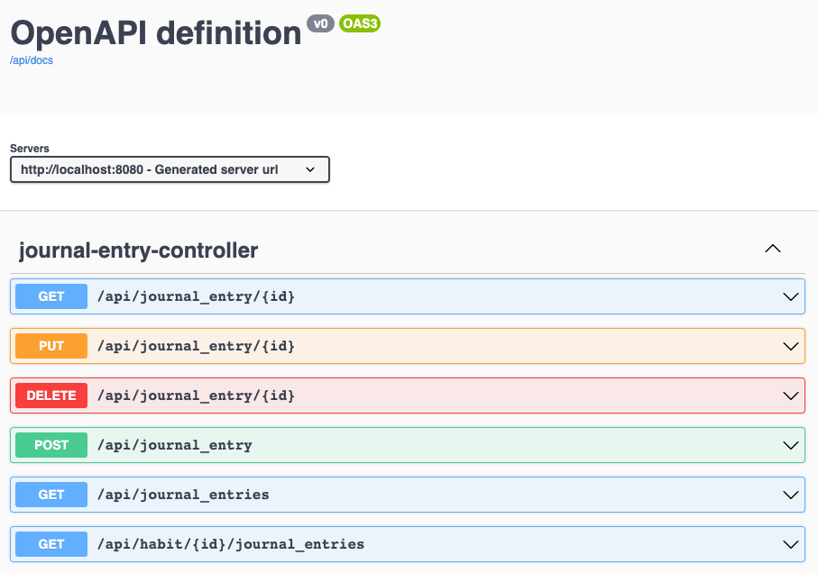
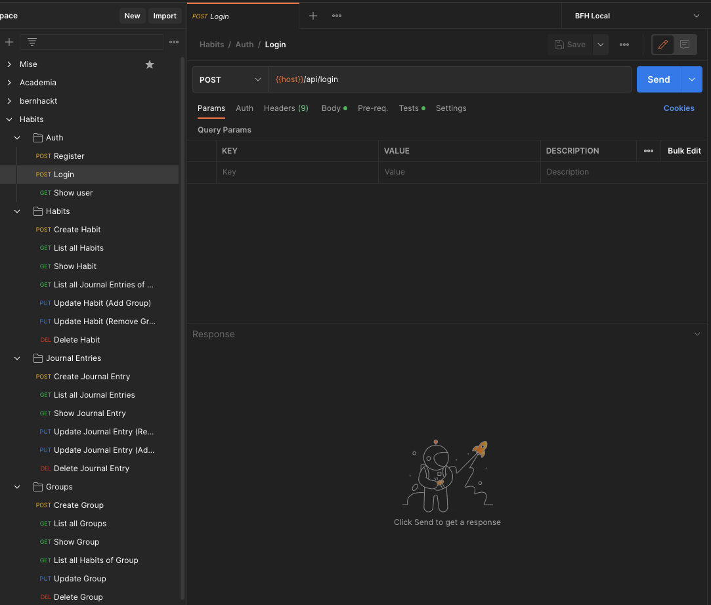
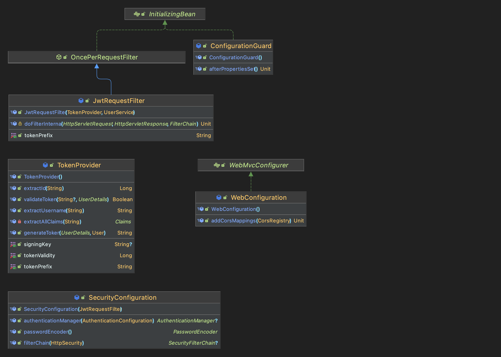
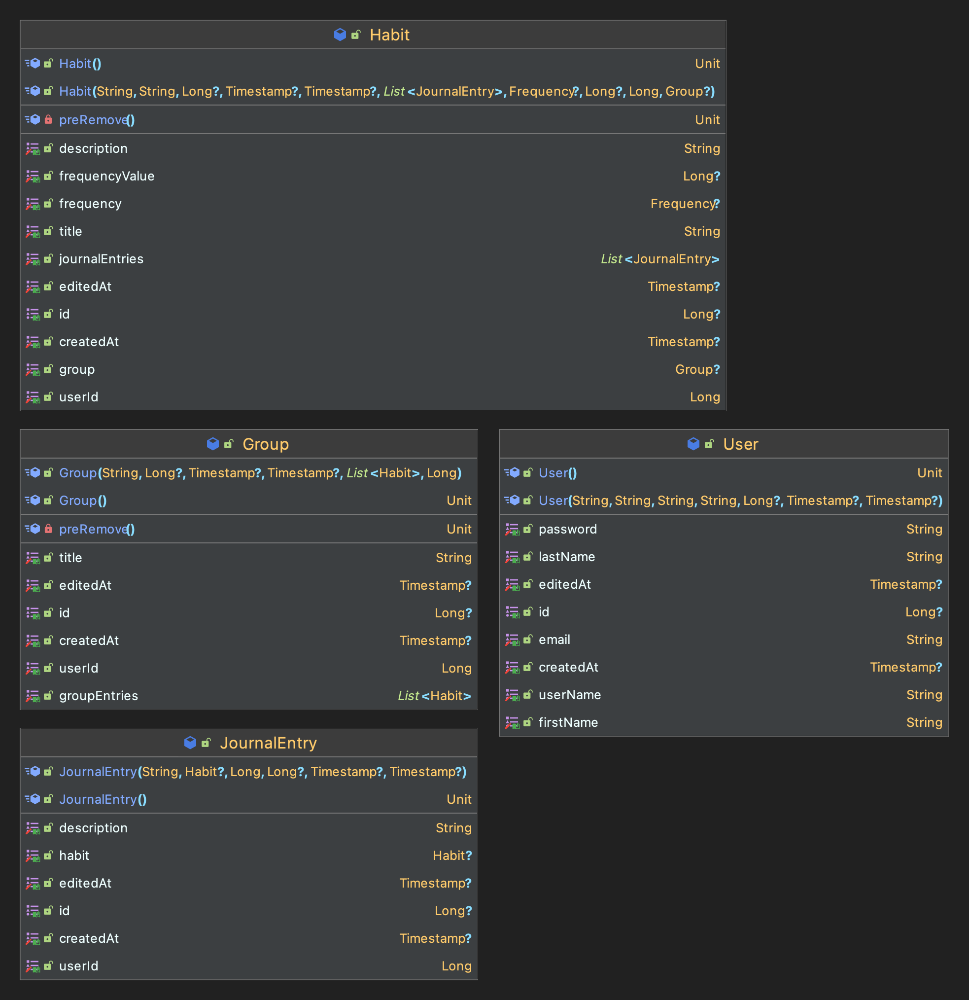
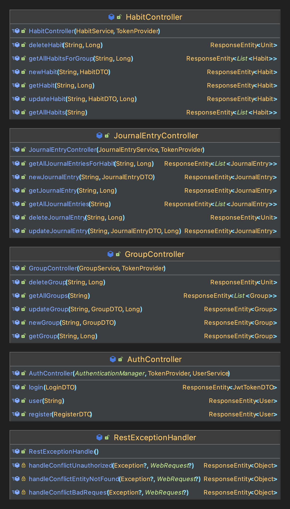
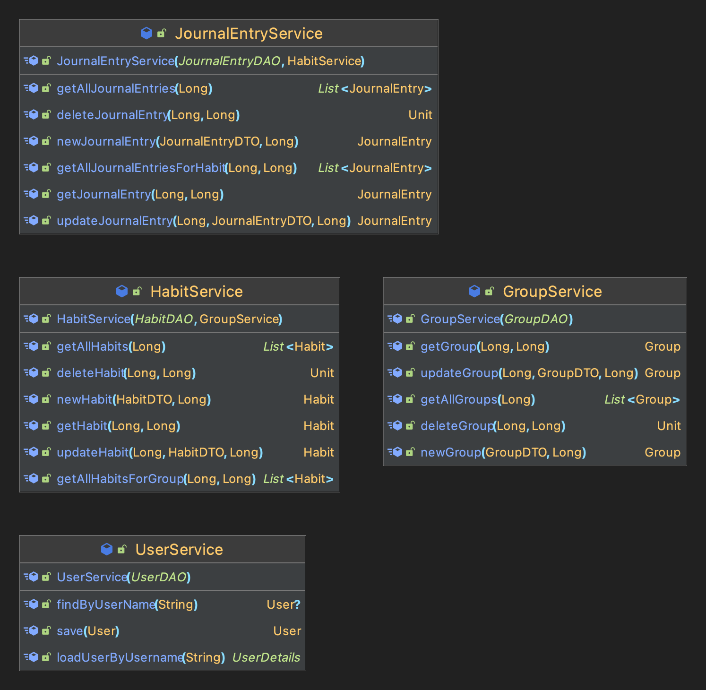
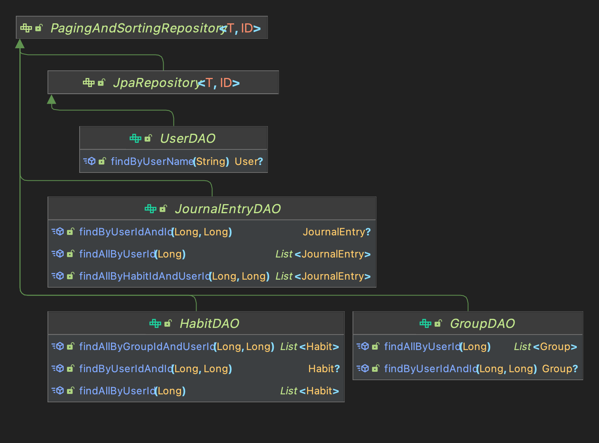
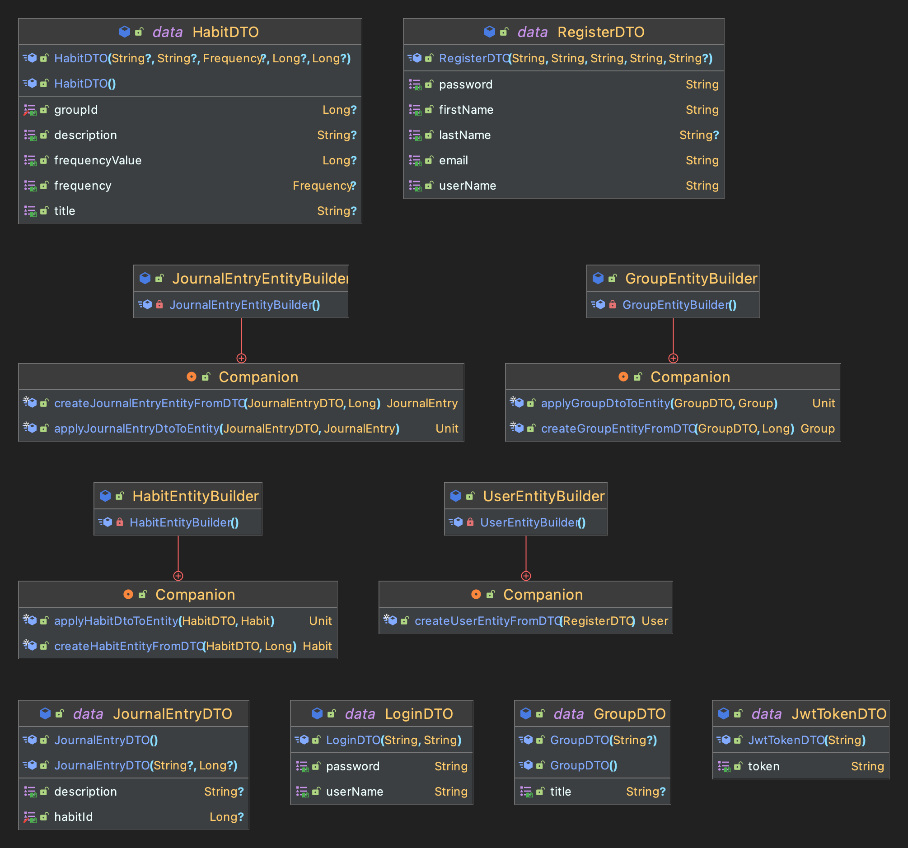
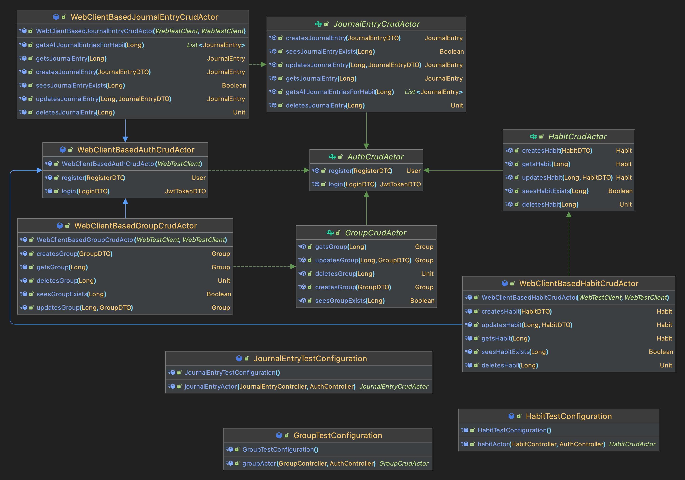

# Backend

The backend is written with Kotlin Spring Boot and uses Flyway for database migrations.
Over JDBC, the backend interacts with a PostgreSQL database.
To secure the endpoints Spring Security in combination with JWTs is used.

## Environments

We have three different environments:
- Production
- Local
- Test

### Production
Environment must be set when using this profile.
More information can be found here: [Getting Started](../getting-started.md)

### Local
Local is used for development.
Flyway is enabled and the backend connects to a local PostgreSQL database.

### Test
Test is used for testing and uses an H2 in-memory database.

## Folder structure

There are three main folders:
- `main` --> Contains the source code
- `feature-test` --> Contains the integration tests
- `test` --> Contains the unit tests

The source code is structured in the following way:
- `config` --> Security and CORS configuration
- `controllers` --> Spring controllers
- `dtos` --> Data transfer objects and builders
- `entities` --> JPA entities
- `exceptions` --> Custom exceptions
- `filters` --> Request filters (e.g. for authentication)
- `respositories` --> JPA repositories
- `services` --> Services to interact with the database
- `testdata` --> Database seed for local environment
- `util` --> Utility classes (e.g. for JWTs)
- `HabitsApplication.kt` --> Entry point of the application

## Authentication and Authorization
### Configuration
The current security configuration looks like this:
```kotlin
        http.
            authorizeRequests { authorizeRequests ->
                authorizeRequests
                    .antMatchers("/api/register", "/api/login", "/api/docs/**", "/api/swagger-ui/**").permitAll()
                    .anyRequest().authenticated()
                    .and().sessionManagement()
                    .sessionCreationPolicy(SessionCreationPolicy.STATELESS)
            }
            .csrf().disable()
            .cors(Customizer.withDefaults())
            .addFilterBefore(jwtRequestFilter, UsernamePasswordAuthenticationFilter::class.java)
            .exceptionHandling().authenticationEntryPoint(HttpStatusEntryPoint(HttpStatus.UNAUTHORIZED))
```

The endpoints `/api/register` and `/api/login` are public and can be accessed without authentication.
Same for the Swagger UI and the OpenAPI documentation.

All other endpoints are protected and require a valid JWT. That is ensured by the `JwtRequestFilter`.

We also load to CORS configuration from the `WebConfiguration.kt` file.

### Implementation
The `AuthController` and the `TokenProvider` are responsible to allow login/register and to generate the tokens.

To do authorization the controller passes the current userId to the service.

```kotlin
    fun getAllHabits(@RequestHeader(value = "Authorization") token: String): ResponseEntity<List<Habit>> {
        val userId = tokenProvider.extractId(token)
        return ResponseEntity.ok().body(service.getAllHabits(userId))
    }
```

The queries then use the userId to filter the results. So if you are trying to access something that you are not allowed you will get a 404.
For POST requests the userId is used to link the newly created entity to the user.

## Testing

### Unit tests
We use `mockk` for mocking classes. Unit tests are used to test our custom/business logic.
We don't want to test JPA or Spring functionality.

Have a look in the `test` folder for examples.

### Integration tests
In the `feature-test` folder we have integration tests. Those are run against the h2 in-memory database.
We use actors that interact with the backend via REST calls. Those actors can and must also register a user and login to fetch a JWT token.

Tests are grouped together via inner classes.
And can also be run sequentially if needed via the `@TestMethodOrder(OrderAnnotation::class)` annotation.

After every inner class the database is reset again to ensure a clean state.

## Exception handling

We use custom exceptions and handle them in the `RestExceptionHandler.kt`.
This means you can throw a custom exception anywhere in the code and the response creation will be handled automatically.

## OpenAPI

The endpoint documentation can be found under `http://localhost:8080/api/swagger-ui` after starting the backend:



## Postman

The Postman collection can be found under `src/main/resources/postman`:



## Classes

The following classes are used for configuration and to handle Authentication:



Those are the entities used. They are all stored in the database:



All the controllers being used:



The services being used by the controllers:



To interact with the database the services use the following DAOs:



To handle incoming requests some custom DTOs are needed:



For the interaction testing we implement test actors that perform the REST operations:


