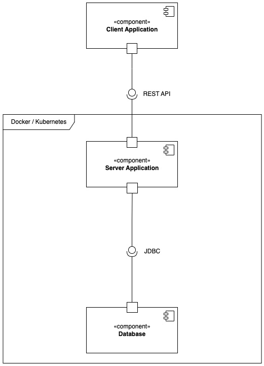
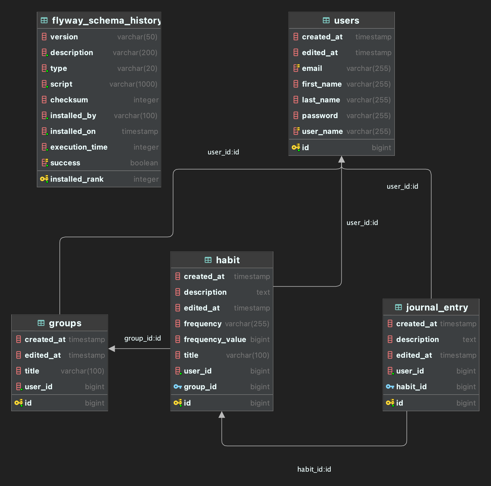

# Architecture Overview

The application consists of three different parts:

- Next.js/React frontend
- Kotlin Spring Boot backend
- PostgreSQL database

The frontend communicates with the backend via REST API calls.
The backend communicates with the database via JDBC.

The whole application is dockerized into three different containers.
Those can then be deployed to a Kubernetes cluster.

## Component Diagram

## Database Diagram

