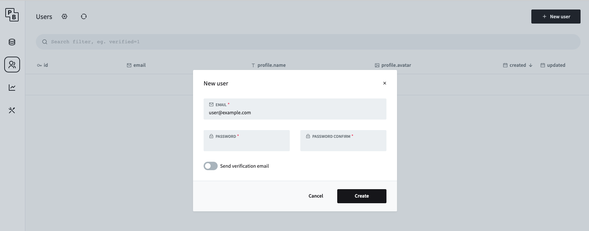
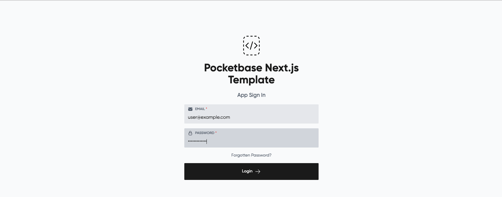

# Create users

There are two types of users:

- **Admin user**: can login in to the admin interface (PocketBase) and create *normal users* for the frontend
- **Normal user**: can login in to the frontend, end-user of the application

## Admin users

### Initial admin user

After the initial start of the backend (PocketBase), you must create an initial admin user as follow:

- go to the Backend Admin Interface: [http://localhost:8090/_/](http://localhost:8090/_/) and create a new user with email and password

### Create additional admin users

You can create more admin users under the settings tab: [http://127.0.0.1:8090/_/?#/settings/admins](http://127.0.0.1:8090/_/?#/settings/admins)

## Normal users

When you are logged in as an *admin user*, you can create a *normal user* as follow:

- in the admin interface, go to the user tab and create a new user

- test the login in to the frontend

