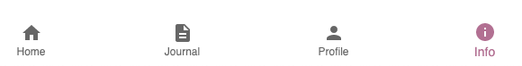

# How to use

## Registration

Registration is currently only possible through Postman.
After you are logged in you have four different pages:

## Home

On the **Home** screen you will find all your habits.
There you can create new habits, edit existing ones, and delete habits.
By each habit you will find a progress bar that shows you how many times you have logged a journal entry for that habit.
You can also directly log a journal entry for a habit by clicking on the + button.

## Journal

On the **Journal** screen you can log a journal entry for any habit.
By logging a journal entry you will increase the progress bar for that habit.
Also you can add a note, edit the note, delete the journal entry and filter them by habit.

## Profile

On the **Profile** screen you can see your profile information and log out.

## Info

On the **Info** screen you can find information about this project.
